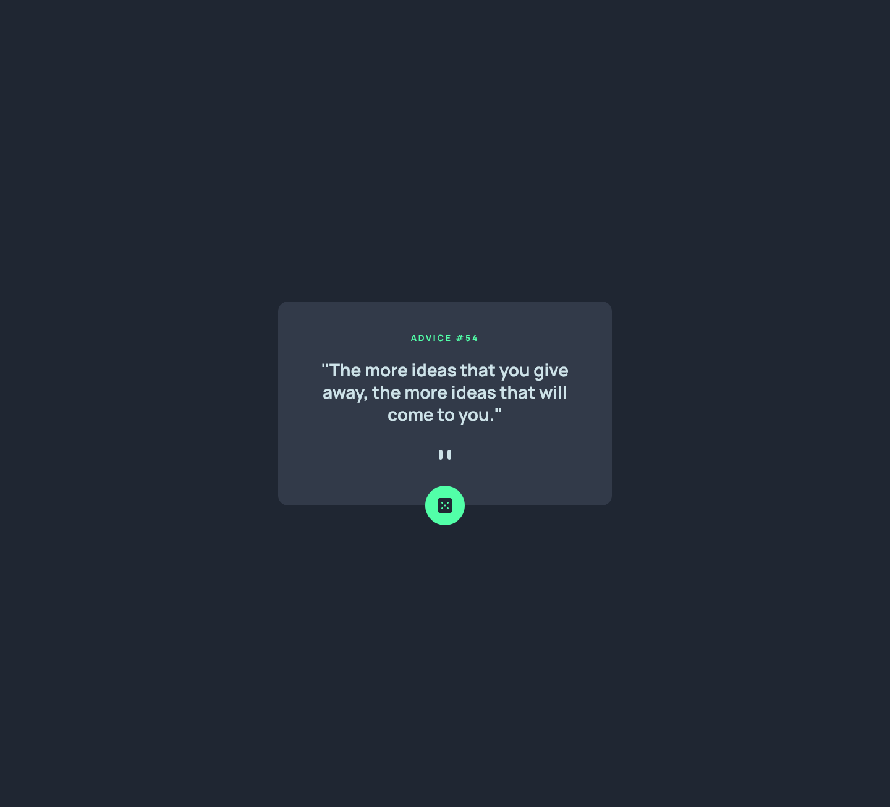

# Frontend Mentor - Advice generator app solution

This is a solution to the [Advice generator app challenge on Frontend Mentor](https://www.frontendmentor.io/challenges/advice-generator-app-QdUG-13db). Frontend Mentor challenges help you improve your coding skills by building realistic projects.

## Table of contents

- [Overview](#overview)
  - [The challenge](#the-challenge)
  - [Screenshot](#screenshot)
  - [Links](#links)
- [My process](#my-process)
  - [Built with](#built-with)
  - [Useful resources](#useful-resources)
- [Author](#author)

## Overview

### The challenge

Users should be able to:

- View the optimal layout for the app depending on their device's screen size
- See hover states for all interactive elements on the page
- Generate a new piece of advice by clicking the dice icon

### Screenshot

### Links

- Solution URL: [Repository Link](https://github.com/mjclaypool/Advice-Generator-App)
- Live Site URL: [Live Link](https://mjclaypool.github.io/Advice-Generator-App/)

## My process

### Built with

- Semantic HTML5 markup
- Flexbox
- Mobile-first workflow
- [React](https://reactjs.org/) - JS library
- [Tailwind CSS](https://tailwindcss.com/) - For styles

### Useful resources

- [Tailwind CSS Documentation](https://tailwindcss.com/docs/installation) - This well-documented reference website helped me efficiently transition from vanilla CSS to Tailwind CSS. It is a popular CSS framework that promotes increased efficiency in styling applications.

## Author

- Website - [Mallory Claypool](https://mjclaypool.github.io/Personal-Portfolio/)
- Frontend Mentor - [@mjclaypool](https://www.frontendmentor.io/profile/mjclaypool)